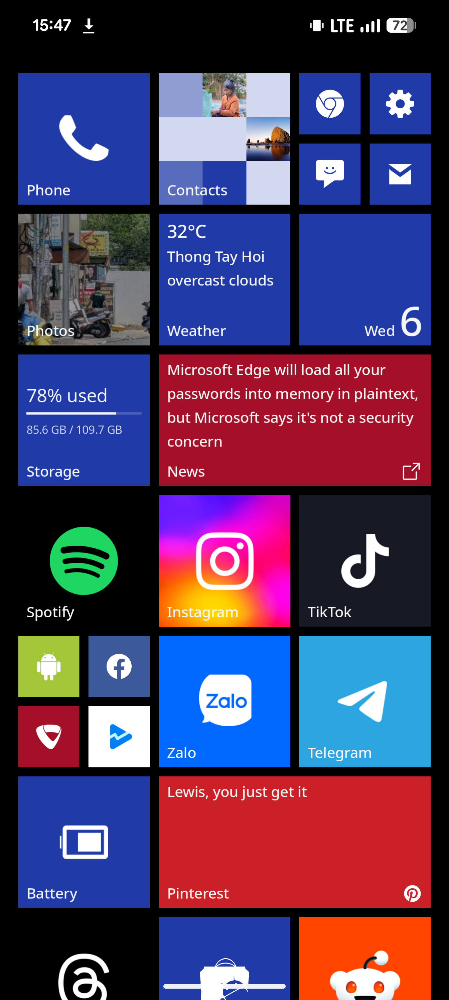
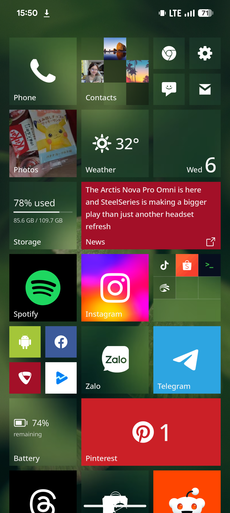
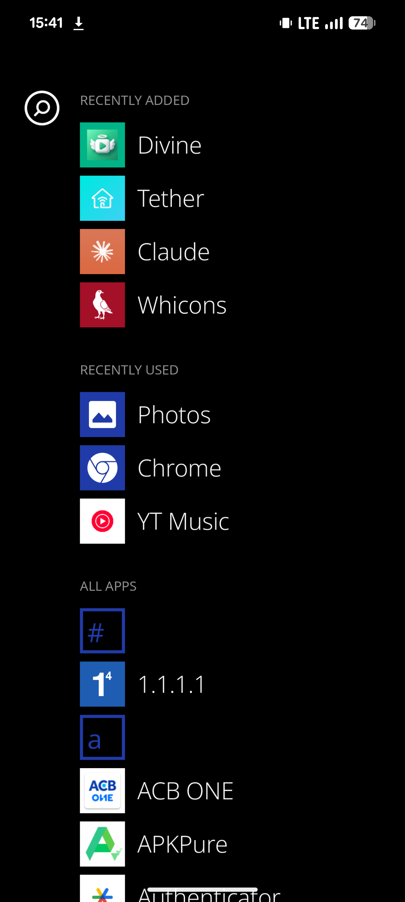
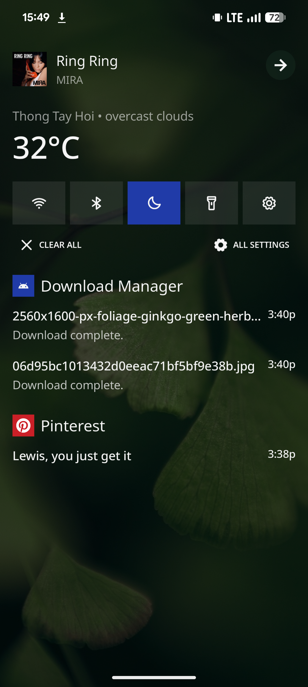
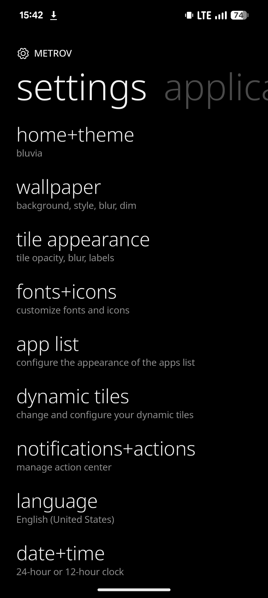

[//]: 

```css
#tuzkituan {
  position: frontend / mobile developer;
  height: 171cm;
  display: boy;
  color: mint;
  skills: html / css / js / ts / reactjs / flutter / linux;
}
```

###

🚀 <b>METROV Launcher</b>

<a href="https://play.google.com/store/apps/details?id=com.tuzkituan.metrov" target="_blank" style="margin-left: -8px">
  
</a>

###

<div style="display: flex; flex-direction: row; flex-wrap: wrap; gap: 24px;">
<a href="assets/Screenshot_20260506-154731.png"></a>
<a href="assets/Screenshot_20260506-155037.png"></a>
<a href="assets/Screenshot_20260506-154158.png"></a>
<a href="assets/Screenshot_20260506-154907.png"></a>
<a href="assets/Screenshot_20260506-154204.png"></a>
</div>
<br />

[MakeUseOf](https://www.makeuseof.com/vanilla-android-decade-i-regret-not-installing-launcher/) &nbsp;·&nbsp;
[Windows Central](https://www.windowscentral.com/hardware/windows-phone/metrov-windows-phone-launcher) &nbsp;·&nbsp;
[Quantrimang](https://quantrimang.com/cong-nghe/cai-dat-launcher-metrov-tren-vanilla-android-211955) &nbsp;·&nbsp;
[Yahoo Tech](https://tech.yahoo.com/apps/articles/closest-ive-felt-using-lumia-131307539.html) &nbsp;·&nbsp;
[Pocket-lint](https://www.pocket-lint.com/best-windows-style-launcher-apps-for-android/)

###

🐱 <b>Contact me</b>

<a href="mailto:tuannguyenitpy@gmail.com" target="_blank">
  
</a>
<a href="https://www.linkedin.com/in/ngoctuanitpy/" target="_blank">
  
</a>
